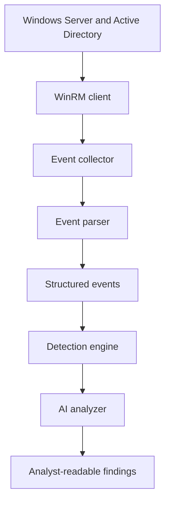

# Agentic AI SOC Analyst

An AI-assisted security operations and threat-hunting project built around my [Windows Server and Active Directory Home Lab](https://github.com/natt20800/Active-Directory-Project). The system collects Windows Security events through WinRM, converts raw event XML into structured Python data, applies deterministic detection logic, and sends evidence-backed results to an initial AI analysis layer.

> **Project status:** Active development. The event collection, parsing, schema, detection, and initial AI-analysis components have been implemented. Multi-step agent investigations, MITRE ATT&CK mapping, guardrails, reporting, and controlled response actions are planned additions.

## Project Goals

- Build a realistic SOC investigation pipeline 
- Collect Windows Security events remotely using tightly scoped WinRM operations.
- Transform raw Windows event XML into consistent dictionaries and JSON.
- Detect suspicious activity with deterministic Python logic before involving AI.
- Use AI to interpret structured evidence rather than giving it unrestricted system access.
- Develop toward a guarded, tool-using SOC agent capable of multi-step investigations.

## Current Architecture



## Implemented Components

| File | Responsibility |
| --- | --- |
| `winrm_client.py` | Establishes the controlled WinRM connection to the Windows Server lab. |
| `event_collector.py` | Executes approved Windows event queries and retrieves Security log records. |
| `event_parser.py` | Converts Windows event XML into normalized Python dictionaries and JSON-ready data. |
| `schemas.py` | Defines and validates the structured objects passed between pipeline stages. |
| `detection_engine.py` | Applies deterministic rules to identify security-relevant activity. |
| `ai_analyzer.py` | Provides the initial AI-assisted interpretation of structured events and detection results. |
| `main.py` | Coordinates the current end-to-end workflow. |

The current investigation focus includes Windows authentication activity such as:

- Event ID **4624** — successful account logon
- Event ID **4625** — failed account logon

## Repository Structure

```text
agentic-ai-soc-analyst/
├── ai_analyzer.py
├── detection_engine.py
├── event_collector.py
├── event_parser.py
├── main.py
├── schemas.py
├── winrm_client.py
├── .env.example
├── .gitignore
├── LICENSE
├── README.md
└── requirements.txt
```

## Development Roadmap

- [x] WinRM client
- [x] Windows Security event collector
- [x] XML event parser and structured JSON output
- [x] Shared data schemas
- [x] Initial deterministic detection engine
- [x] Initial AI analysis layer
- [ ] Expand event coverage and correlation rules
- [ ] MITRE ATT&CK technique mapping
- [ ] Approved investigation-tool router
- [ ] Multi-step SOC investigation agent
- [ ] Prompt-injection and tool-use guardrails
- [ ] Investigation logging and report generation
- [ ] Human-approved response actions
- [ ] Automated tests and sanitized sample telemetry

## Skills Demonstrated

- Python security automation
- Windows Security Event Log analysis
- Active Directory authentication monitoring
- WinRM and PowerShell integration
- XML parsing and JSON data pipelines
- Schema validation and structured AI inputs
- Detection engineering
- Secure AI-tool architecture
- SOC investigation workflow design
